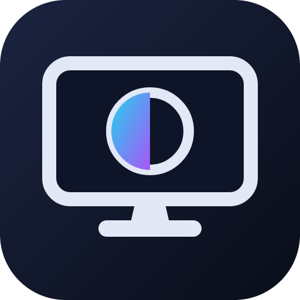
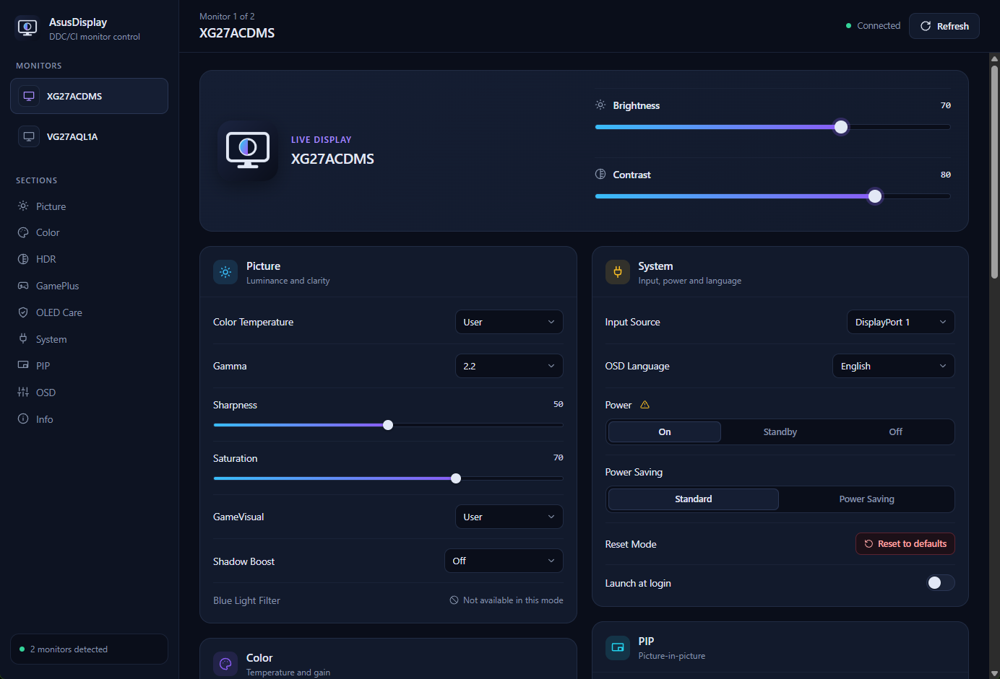
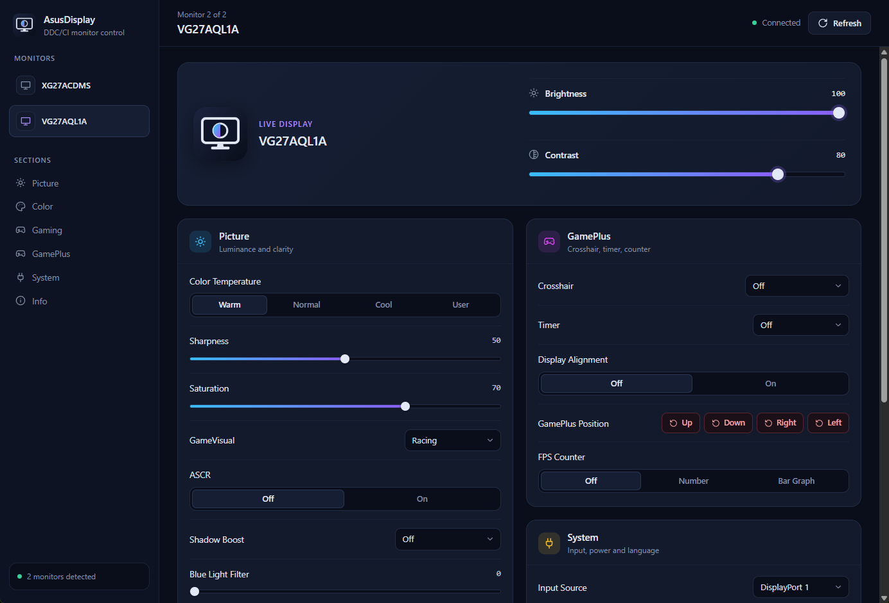

<p align="center">
  
</p>

<h1 align="center">AsusDisplay</h1>

<p align="center">
  Control your ASUS monitor from a clean desktop app or the command line — on <b>Linux</b> and <b>Windows</b>.<br>
  Brightness, contrast, GameVisual/Splendid modes, HDR, OLED care, GamePlus, colour, input and more.
</p>

<p align="center">
  
</p>

ASUS only ships **DisplayWidget Center** (and the older DisplayWidget / ASUS DisplayWidget) for
Windows, and there's nothing for Linux at all. AsusDisplay is an open, lightweight re-implementation
of its monitor controls. The app is a single native binary (a few MB), with no .NET runtime, no
telemetry and no account.

## Why

- **It's the only option on Linux.** No official ASUS monitor software exists for Linux.
- **It's lighter on Windows.** DisplayWidget Center bundles a ~250 MB AI engine and a WebView2 app;
  this is a small native window.
- **It shows only what your monitor has.** Settings are read from the monitor itself, so you don't
  see controls your panel doesn't support.

## How it works

DisplayWidget Center doesn't use a special driver — it sends standard **DDC/CI** commands (VESA
MCCS) over the display cable, plus a set of ASUS-specific VCP codes (`0xDC`, `0xE0`–`0xFF`).
AsusDisplay sends the same commands:

- **Linux:** straight over `/dev/i2c-*` (just needs the `i2c-dev` kernel module; no ddcutil).
- **Windows:** through the built-in monitor API (`dxva2.dll`), exactly like the ASUS app.

The full code map, and how each setting was worked out, is in [docs/PROTOCOL.md](docs/PROTOCOL.md).

## Supported devices

The app has **no model list**. It reads each monitor's own capability report and the ASUS table
version, then shows the settings that monitor actually exposes — the same way DisplayWidget Center
does. So any ASUS monitor that works with the Windows app should work here.

| Model | Panel | Status |
|---|---|---|
| ROG Strix XG27ACDMS | QD-OLED | verified on hardware (read + write) |
| TUF Gaming VG27AQL1A | IPS | verified on hardware (read + write) |
| Other ROG / TUF / ProArt / ZenScreen | — | should work; untested, reports welcome |
| Non-ASUS monitors | — | standard controls only (brightness, contrast, input, colour) |

Non-ASUS monitors get the standard DDC/CI controls; the ASUS-only settings are hidden automatically.
If you try a model that isn't listed, please [open an issue](../../issues) with the result — even if
it just works. See [Adding your device](#adding-your-device).

<p align="center">
  
  <br><em>The UI adapts per monitor — a different panel shows different sections and controls.</em>
</p>

## Install

### Linux

```sh
# Arch (see https://v2.tauri.app/start/prerequisites/ for other distros)
sudo pacman -S --needed rust pnpm webkit2gtk-4.1 base-devel openssl librsvg

git clone https://github.com/KharalDipendra/Asus-Displaywidget-Linux
cd Asus-Displaywidget-Linux

# command line tool
cargo build --release
sudo install -Dm755 target/release/asusdisplay /usr/local/bin/asusdisplay

# desktop app
cd gui && pnpm install && pnpm tauri build
# the installer (.deb / .rpm / AppImage) lands in gui/src-tauri/target/release/bundle/
```

Give yourself I2C access once:

```sh
sudo install -Dm644 linux/i2c-dev.conf /etc/modules-load.d/i2c-dev.conf
sudo install -Dm644 linux/60-asusdisplay-i2c.rules /etc/udev/rules.d/60-asusdisplay-i2c.rules
sudo modprobe i2c-dev
sudo udevadm control --reload && sudo udevadm trigger
```

The udev rule grants the logged-in user access to GPU I2C buses only. If you already run `ddcutil`,
its rule does the same and you can skip ours.

### Windows

Needs the [.NET-free Rust toolchain](https://rustup.rs), [Node + pnpm](https://pnpm.io), and Visual
Studio Build Tools with the **Desktop development with C++** workload.

```powershell
git clone https://github.com/KharalDipendra/Asus-Displaywidget-Linux
cd Asus-Displaywidget-Linux
cargo build --release                 # CLI -> target\release\asusdisplay.exe
cd gui; pnpm install; pnpm tauri build # app  -> gui\src-tauri\target\release\
```

DisplayWidget Center can stay installed, but don't run both at once — DDC/CI doesn't like two
programs talking to the monitor together.

### Troubleshooting (Linux)

- **Nothing found with the NVIDIA proprietary driver:** add
  `options nvidia NVreg_RegistryDwords=RMUseSwI2c=0x01;RMI2cSpeed=100` to
  `/etc/modprobe.d/nvidia-i2c.conf` and reboot.
- **Reads fail intermittently:** some monitors need more time between commands — try `--sleep-mult 2`.
- **App window is blank (NVIDIA):** launch with `WEBKIT_DISABLE_DMABUF_RENDERER=1`.

## Using the app

Pick a monitor in the sidebar. Sliders apply when you release them. Picking a mode or preset
re-reads everything, since the monitor relocks other controls. Settings locked in the current mode
show as "Not available in this mode". **Launch at login** (Linux) adds an autostart entry.
Disruptive actions (OLED pixel cleaning, reset, power off) ask first.

## Using the command line

```sh
asusdisplay list                       # monitors
asusdisplay status                     # every supported setting and its value
asusdisplay get brightness
asusdisplay set brightness 40
asusdisplay set brightness +10         # relative
asusdisplay set mode fps               # GameVisual / Splendid mode
asusdisplay set uniform-brightness off # toggles take on / off / toggle
asusdisplay set input hdmi1
asusdisplay -d VG27 set contrast 75    # pick a monitor by index, model, serial or connector
asusdisplay -d all set brightness -10  # every monitor at once
asusdisplay debug                      # list settings this monitor doesn't expose, and why
asusdisplay features                   # names, VCP codes and accepted values
```

Brightness and the other sliders apply in about 0.2 s, so they work well bound to keyboard
shortcuts. Disruptive settings and values outside what the monitor advertises need `--force`.
`asusdisplay raw 0xE9` reads any VCP code and `asusdisplay raw 0xE9 1` writes it, without checks.

If you have an ASUS monitor light bar, `asusdisplay lightbar white 60 5000` and
`asusdisplay lightbar rgb static 255 80 0` control it (Linux, hidraw).

## Adding your device

1. Attach the output of these to an issue:
   ```sh
   asusdisplay caps > caps.txt
   asusdisplay status --all > status.txt
   asusdisplay debug > debug.txt
   ```
2. For a setting that reads wrong or `unknown`: run `asusdisplay raw 0xNN`, change it in the
   monitor's OSD, run it again, and note which value moved.
3. Add or fix entries in `src/features.rs`, run `cargo test`, and open a PR — mention which settings
   you checked on the real monitor.

## About this project

AsusDisplay was built with substantial help from AI (Anthropic's Claude):

- **Protocol.** The DDC/CI protocol and ASUS's private VCP codes were reverse engineered by
  decompiling ASUS DisplayWidget Center and tracing how each UI setting maps to a monitor command.
- **Code.** AI helped write the Rust backend and the CLI.
- **Frontend UI.** AI helped scaffold the Vue/TypeScript frontend for the Tauri app, including
  component layout, styling and state wiring.

All AI output is reviewed personally before being committed. Protocols for the devices I own were
validated against real hardware; support for other models relies on community testing and feedback,
so bug reports and PRs are very welcome.

No ASUS code is included in this repository. This project is not affiliated with, authorised by, or
endorsed by ASUS. "ASUS", "ROG", "TUF" and "ProArt" are trademarks of their owner.

## License

MIT — see [LICENSE](LICENSE).
