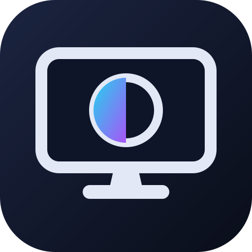
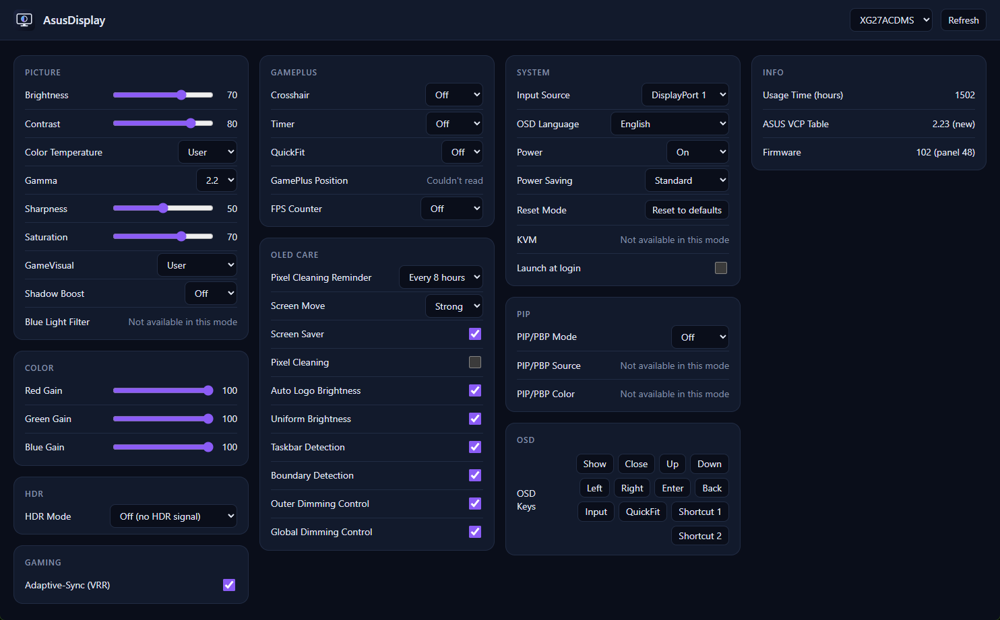

<p align="center"></p>

# asusdisplay

Control ASUS monitor settings on Linux: brightness, contrast, GameVisual modes, HDR mode,
OLED care, GamePlus, input and more. There's a desktop app and a command line tool.

ASUS only ships DisplayWidget Center for Windows. This is an open re-implementation of its
monitor controls.



## How it works

DisplayWidget Center doesn't use a special driver. It sends standard DDC/CI commands (VESA MCCS)
over the display cable, plus a set of ASUS-specific VCP codes (0xDC, 0xE0-0xFF). asusdisplay sends
the same commands through Linux's `/dev/i2c-*` devices. No ddcutil or kernel module beyond
`i2c-dev` is needed.

Each monitor reports which codes it supports, so the app only shows the settings your monitor
has. The full code map, and how each entry was worked out, is in [docs/PROTOCOL.md](docs/PROTOCOL.md).

## Supported devices

| Model | Panel | ASUS VCP table | Status |
|---|---|---|---|
| ROG Strix XG27ACDMS | QD-OLED | new | protocol verified on hardware (read and write) |
| TUF VG27AQL1A | IPS | legacy | protocol verified on hardware (read) |

The protocol was verified on these monitors during development through Windows' DDC API, which is
what DisplayWidget Center uses. The Linux I2C path still needs testing on real hardware.

Other ASUS monitors that work with DisplayWidget Center should work too. The code map covers all
of its product lines (ROG/TUF, mainstream, ZenScreen portable, ProArt), and it includes the
built-in capability lists DisplayWidget Center uses for monitors that don't report their own
(PG49WCD, PG34WCDM, PG32UCDM, XG27ACDNG and ProArt). None of those have been tested yet.

Non-ASUS monitors work for the standard controls: brightness, contrast, input and color gains.

If you try it on a model that isn't listed, please open an issue with the result, even if it
worked fine. See [Adding your device](#adding-your-device).

## Install

Build dependencies on Arch (the GUI needs WebKitGTK, see [Tauri's prerequisites](https://tauri.app/start/prerequisites/)
for other distros):

```sh
sudo pacman -S --needed rust pnpm webkit2gtk-4.1 base-devel openssl librsvg
```

The command line tool:

```sh
cargo build --release
sudo install -Dm755 target/release/asusdisplay /usr/local/bin/asusdisplay
```

The app:

```sh
cd gui
pnpm install
pnpm tauri build --no-bundle
sudo install -Dm755 src-tauri/target/release/asusdisplay-gui /usr/local/bin/asusdisplay-gui
```

`pnpm tauri build` without `--no-bundle` also produces .deb, .rpm and AppImage packages.

### I2C access (once)

```sh
sudo install -Dm644 linux/i2c-dev.conf /etc/modules-load.d/i2c-dev.conf
sudo install -Dm644 linux/60-asusdisplay-i2c.rules /etc/udev/rules.d/60-asusdisplay-i2c.rules
sudo modprobe i2c-dev
sudo udevadm control --reload && sudo udevadm trigger
```

The udev rule gives the logged-in user access to the graphics card's I2C buses only. If you
have ddcutil installed, its rule does the same and you can skip ours.

### Troubleshooting

- **Nothing found with the NVIDIA driver:** add
  `options nvidia NVreg_RegistryDwords=RMUseSwI2c=0x01;RMI2cSpeed=100` to
  `/etc/modprobe.d/nvidia-i2c.conf` and reboot.
- **Reads fail now and then:** some monitors need more time between commands. Try `--sleep-mult 2`.
- **The app window stays blank (NVIDIA):** start it with `WEBKIT_DISABLE_DMABUF_RENDERER=1`.

## The app

Pick the monitor at the top. Sliders write when you let go. Picking a mode or preset re-reads
everything, since the monitor switches other settings along with it. Settings the monitor locks
in the current mode show as "Not available in this mode".

**Launch at login** in the System section adds an autostart entry to `~/.config/autostart`.

Disruptive actions, like starting OLED pixel cleaning (the screen goes dark for about 6 minutes)
or resetting the mode, ask for confirmation first.

## Command line

```sh
asusdisplay list                          # monitors
asusdisplay status                        # every supported setting and its value
asusdisplay features                      # setting names, VCP codes and accepted values
asusdisplay get brightness
asusdisplay set brightness 40
asusdisplay set brightness +10            # relative
asusdisplay set mode fps                  # GameVisual mode
asusdisplay set uniform-brightness off    # toggles take on, off or toggle
asusdisplay set input hdmi1
asusdisplay set osd show                  # press OSD keys remotely
asusdisplay -d XG27 set contrast 75       # pick a monitor by index, model, serial or connector
asusdisplay -d all set brightness -10     # every monitor
```

Brightness and the other sliders apply in about 0.2 seconds, so they work well bound to keyboard
shortcuts.

Disruptive settings need `--force`. So do values the monitor doesn't list in its capabilities.
`asusdisplay raw 0xE9` reads any VCP code, and `asusdisplay raw 0xE9 1` writes it, without checks.

## Adding your device

1. Dump what the monitor reports and attach it to an issue:
   ```sh
   asusdisplay caps > caps.txt
   asusdisplay status --all > status.txt
   ```
2. For a setting that shows the wrong value or `unknown`, find its code: run
   `asusdisplay raw 0xNN`, change the setting in the monitor's OSD, run it again, and note
   which value changed.
3. If you have the Windows app, `C:\Program Files (x86)\ASUS\DisplayWidgetCenter\UserConfig\CapabilityData.json`
   also contains your monitor's capabilities string.
4. Add or fix entries in `src/features.rs`. If your monitor doesn't answer the capabilities
   request, add its string to the fallbacks in `src/caps.rs`. Run `cargo test` and open a PR,
   and mention which settings you checked on the real monitor.

## Development

```sh
cargo test                  # protocol, capabilities parser, EDID, feature table, write logic
cd gui && pnpm tauri dev    # the app with hot reload
```

## About this project

**Protocol.** The protocol was reverse engineered with the help of Claude (Anthropic's AI model).
I decompiled ASUS DisplayWidget Center (a .NET app) and traced how each setting in its UI maps
to a DDC/CI VCP code. Claude also helped write the code.

**Frontend UI.** AI helped scaffold the Vue/TypeScript frontend for the Tauri GUI, including
component layout, styling, and state wiring.

All AI output is reviewed personally before being committed. Protocols for devices I own were
validated against real hardware; others rely on community testing and feedback.

No ASUS code is included in this repository. This project is not affiliated with or endorsed by ASUS.

## Bug reports

Bug reports are welcome. Please include your monitor model, distro, GPU and driver, the command
you ran, and its output with `-v`.
